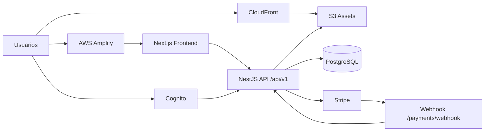

# PrimeStore: Arquitectura Full Stack en AWS

<p align="center">
  
</p>

<p align="center">
  <strong>MVP evolutivo de GeoTechShop</strong><br/>
  Construido para mejorar el MVP original y validar capacidades de arquitectura, despliegue y operación en AWS.
</p>

<p align="center">
  
</p>

## Contexto del proyecto

Este repositorio representa la evolución del MVP de **GeoTechShop** hacia una arquitectura más robusta, escalable y preparada para producción.

Objetivos principales:

- Mejorar la experiencia funcional del MVP inicial de e-commerce.
- Implementar un flujo realista de autenticación, catálogo, carrito, checkout y órdenes.
- Validar conocimientos técnicos en **AWS** mediante un despliegue de arquitectura distribuida (multi-AZ, edge, seguridad y observabilidad).
- Dejar una base mantenible para continuar iterando producto e infraestructura.

## Stack tecnológico

### Frontend

- Next.js 16 (App Router) + React 19 + TypeScript
- Tailwind CSS 4 + componentes UI reutilizables
- Framer Motion para animaciones
- Sonner para toasts
- Integración HTTP con backend vía `clientApiFetch`

### Backend

- NestJS 11 + TypeScript
- TypeORM + PostgreSQL
- Passport + JWT Strategy con JWKS de Cognito
- Stripe para pagos y webhooks
- AWS SDK v3 para integración S3/CloudFront

### Infraestructura (AWS orientada a producción)

- CloudFront para distribución global de estáticos
- AWS Amplify como plataforma de frontend
- Amazon Cognito para autenticación/OIDC
- VPC con diseño multi-AZ
- Application Load Balancer (ALB)
- EC2 Auto Scaling Group
- S3 para assets
- CloudWatch / EventBridge / SNS para observabilidad y eventos
- Base de datos PostgreSQL (Supabase, según arquitectura actual de despliegue)

## Arquitectura de alto nivel



## Estructura del repositorio

```text
aws-ecommerce/
├─ backend/                  # API NestJS
│  ├─ src/
│  │  ├─ auth/               # Login Cognito + callback + guard JWT
│  │  ├─ catalog/            # Brands, Categories, Products, Attributes, Options
│  │  ├─ orders/             # Órdenes y estados
│  │  ├─ payments/           # Checkout Stripe + confirmación + webhook
│  │  ├─ aws-s3/             # Upload/Delete en S3 y URL CloudFront
│  │  ├─ users/              # Usuarios locales y sync desde Cognito
│  │  ├─ health/             # Health check
│  │  └─ app.module.ts       # Composición global
│  └─ package.json
├─ frontend/                 # App Next.js
│  ├─ app/                   # Rutas App Router
│  ├─ components/            # UI + módulos de dominio
│  ├─ context/               # Estado global (carrito)
│  ├─ hooks/                 # Guards y lógica compartida
│  ├─ services/              # Cliente API
│  ├─ mocks/                 # Mocks de categorías, marcas y reseñas
│  └─ package.json
└─ README.md                 # Este documento
```

## Backend: diseño por módulos

### Módulos principales

- `AuthModule`
  - `GET /auth/login`, `GET /auth/register`, `GET /auth/callback`, `GET /auth/logout`, `GET /auth/me`
  - Intercambio OAuth2 con Cognito.
  - Guarda `access_token` e `id_token` en cookies HTTP-only.
  - Usa `CognitoAuthGuard` para proteger rutas.
- `ProductsModule` (catálogo)
  - CRUD de productos.
  - Carga de imágenes (Multer + S3).
  - Endpoint `GET /products/home` para tabs del home.
  - Relaciones con atributos y option groups.
- `OrdersModule`
  - Creación y lectura de órdenes por usuario autenticado.
  - Cancelación y actualización de estado.
  - Reversión de stock al cancelar.
- `PaymentsModule`
  - `POST /payments/checkout-session`: crea orden `PENDING` y sesión Stripe.
  - `POST /payments/confirm-session`: confirma pago del usuario.
  - `POST /payments/webhook`: sincroniza estado (`PAID`, `CANCELED`, etc.) por eventos Stripe.
- `AwsS3Module`
  - Subida y borrado de archivos en S3.
  - Construcción de URL pública vía CloudFront.
- `UsersModule`
  - CRUD de usuarios locales.
  - `upsertFromCognito` para sincronizar identidad Cognito con DB local.
- `HealthController`
  - `GET /health` => `{ status: "ok" }`

### Persistencia y modelo de datos

El backend usa **TypeORM** con Postgres (`synchronize: false`) y `autoLoadEntities`.

Entidades clave:

- `User`: identidad local alineada con `cognitoSub`.
- `Product`: catálogo principal.
- `ProductImage`: URLs de imágenes + featured + posición.
- `AttributeDefinition` / `ProductAttributeValue`: especificaciones técnicas tipadas.
- `OptionGroup` / `OptionValue`: variantes y ajustes de precio.
- `Order` / `OrderItem`: snapshot transaccional de compra.
- `OrderStatus`: `PENDING`, `PAID`, `PROCESSING`, `SHIPPED`, `DELIVERED`, `CANCELED`, `REFUNDED`.

### Seguridad y validación

- Prefijo global API: `/api/v1`.
- Cookies de sesión con `httpOnly`, `sameSite`, `secure` según entorno.
- Validación global DTO con `ValidationPipe` (`whitelist`, `transform`).
- CORS habilitado con `credentials: true`.
- Verificación JWT con JWKS de Cognito.

## Frontend: arquitectura funcional

### Rutas principales (App Router)

- `/` home con tabs dinámicos y secciones de catálogo.
- `/catalog` filtros por categoría/marca y cards de producto.
- `/product/[id]` detalle de producto, variantes y reseñas mock.
- `/cart` carrito editable.
- `/checkout` flujo seguro de compra autenticada.
- `/checkout/success` confirmación y resumen.
- `/checkout/cancel` cancelación de pago.
- `/profile` historial de órdenes.
- `/profile/orders/[id]` detalle de orden.
- `/login`, `/register` integración con Cognito.
- `/contact` formulario simulado de contacto con toast.

### Patrones de frontend

- `layout.tsx` centraliza navbar, footer, provider de carrito y toaster global.
- `CartContext` gestiona estado de carrito en cliente.
- `useAuthGuard` protege páginas privadas y redirige a login con `next`.
- `clientApiFetch` maneja timeouts, errores tipados y mensajes amigables.
- Mocks (`mocks/reviews.ts`) para completar espacios UX sin depender de backend.

## Flujos end-to-end

### 1) Autenticación

1. Usuario entra por `/login` o `/register`.
2. Backend redirige a Cognito.
3. Cognito retorna `code` a `/auth/callback`.
4. Backend intercambia tokens, sincroniza usuario local y setea cookies.
5. Frontend usa `/auth/me` para validar sesión.

### 2) Compra y pago

1. Usuario agrega productos al carrito.
2. En checkout se envía carrito + shipping a `POST /payments/checkout-session`.
3. Backend crea orden `PENDING`, calcula totales y abre sesión Stripe.
4. Stripe redirige a success/cancel.
5. Frontend confirma sesión (`/payments/confirm-session`) y/o webhook de Stripe actualiza estado.
6. Orden queda visible en perfil.

### 3) Catálogo

1. Front consume `/products` y `/products/home`.
2. Filtros por categoría/marca en cliente.
3. Detalle de producto consume `/products/:id` con atributos y opciones.

## Variables de entorno

### Backend (`backend/.env`)

| Variable | Propósito |
|---|---|
| `PORT` | Puerto de la API |
| `DB_HOST`, `DB_PORT`, `DB_USER`, `DB_PASS`, `DB_NAME` | Conexión PostgreSQL |
| `NODE_ENV` | Entorno (`development`/`production`) |
| `COOKIE_DOMAIN` | Dominio de cookies en producción |
| `AWS_REGION` | Región AWS |
| `AWS_ACCESS_KEY_ID`, `AWS_SECRET_ACCESS_KEY` | Credenciales AWS |
| `AWS_S3_BUCKET` | Bucket de imágenes |
| `AWS_S3_UPLOAD_PREFIX` | Prefijo para objetos en S3 |
| `AWS_CLOUDFRONT_URL` | Base URL pública de CloudFront |
| `COGNITO_USER_POOL_ID` | User Pool para validar JWT |
| `COGNITO_DOMAIN` | Dominio OAuth Cognito |
| `COGNITO_CLIENT_ID`, `COGNITO_CLIENT_SECRET` | Cliente OAuth |
| `COGNITO_REDIRECT_URI` | Redirect URI para callback |
| `APP_URL` | URL pública de la app |
| `FRONTEND_URL` | URL frontend usada en Stripe redirects |
| `STRIPE_SECRET_KEY` | API key Stripe |
| `STRIPE_WEBHOOK_SECRET` | Firma del webhook Stripe |

### Frontend (`frontend/.env`)

| Variable | Propósito |
|---|---|
| `NEXT_PUBLIC_API_BASE_URL` | Base URL de backend |
| `NEXT_PUBLIC_API_TIMEOUT_MS` | Timeout por defecto para fetch |
| `NEXT_PUBLIC_AWS_CLOUDFRONT_URL` | Base URL CloudFront para assets (logo, hero, etc.) |

## Ejecutar en local

## 1) Backend

```bash
cd backend
npm install
npm run start:dev
```

API disponible en `http://localhost:3000/api/v1`.

## 2) Frontend

```bash
cd frontend
npm install
npm run dev
```

App disponible en `http://localhost:3000` (o puerto asignado por Next).

## Calidad y verificación

### Backend

```bash
cd backend
npm run test
npm run test:e2e
npm run build
```

### Frontend

```bash
cd frontend
npm run lint
npm run build
```

## Foco estratégico del proyecto

Este trabajo se construyó explícitamente para:

- **Elevar el MVP de GeoTechShop** a una solución más sólida.
- **Demostrar capacidad de diseño e implementación en AWS**, incluyendo:
  - edge distribution,
  - autenticación gestionada,
  - backend escalable,
  - integración de pagos,
  - trazabilidad operativa.

En resumen: este repositorio no solo implementa una tienda; documenta una evolución real de producto + arquitectura cloud.